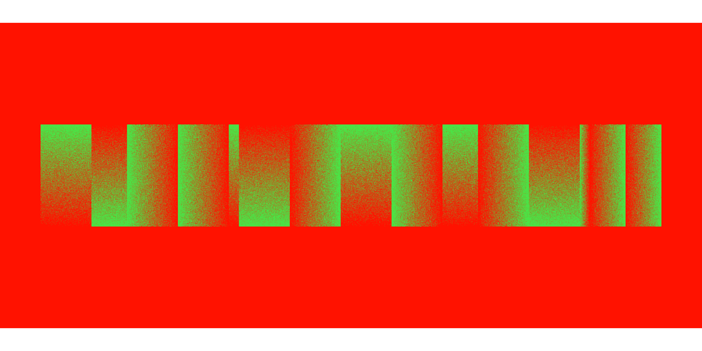

# gradients

i love geom_point() okay

## live wire

```{r, echo = FALSE, fig.alt = "A series of fifteen gradients going from bright green to bright red. They vary in width and some are very narrow, but they are all the same height. Some of the gradients go vertically, from green to red or from red to green, and some go horizontally. They are all placed on top of a red rectangle, the same colour as the red in the gradient."}

```

## strange airlines

```{r, echo = FALSE, fig.alt = "Eight vertical strips, each going in gradient from either mid tone blue to sky blue, or sky blue to mid tone blue, in alternating order. The gradient makes it almost looks like a checkerboard of the colours, with a noisy band mid way through the strips."}
knitr::include_graphics("strange_airlines/strange_airlines.png")
```

## Phantom's Shadow

A recreation of [my piece made in procreate](https://twitter.com/sharlagelfand/status/1418021325822701574) (which is a reinterpretation of [Odili Donald Odita's "Phantom's Shadow"](https://www.stevenson.info/exhibition/3088/work/3))

```{r, echo = FALSE, fig.alt = "A grid of 8 tiles down and 8 tiles across in various colours of teal mustard dark blue and salmon with a grey border. Some of the tiles are squares of solid colors. Some are rectangles with two squares combined, either horizontally or vertically, forming a gradient of their respective colors for example a gradient from salmon to dark blue."}
knitr::include_graphics("phantoms_shadow/phantoms_shadow.png")
```

## Phantom

An interpretation of [Odili Donald Odita's "Phantom"](https://www.stevenson.info/exhibition/3088/work/2)

```{r, echo = FALSE, fig.alt = "A grid of 8 tiles down and 8 tiles across in various colours of yellow, pink, orange, maroon, blue, and brown. Some of the tiles are squares of solid colors. Some are rectangles with two squares combined, either horizontally or vertically, forming a gradient of their respective colors for example a gradient from light yellow to pink or gold to orange."}
knitr::include_graphics("phantom/phantom.png")
```
